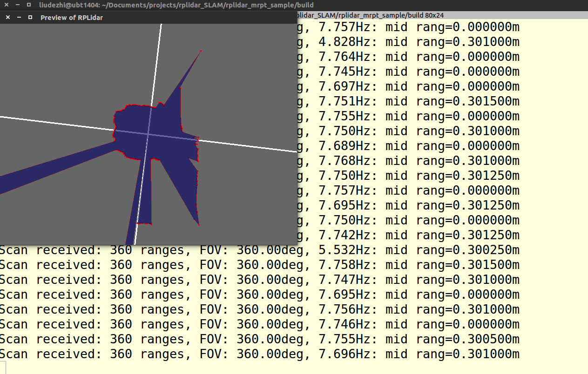
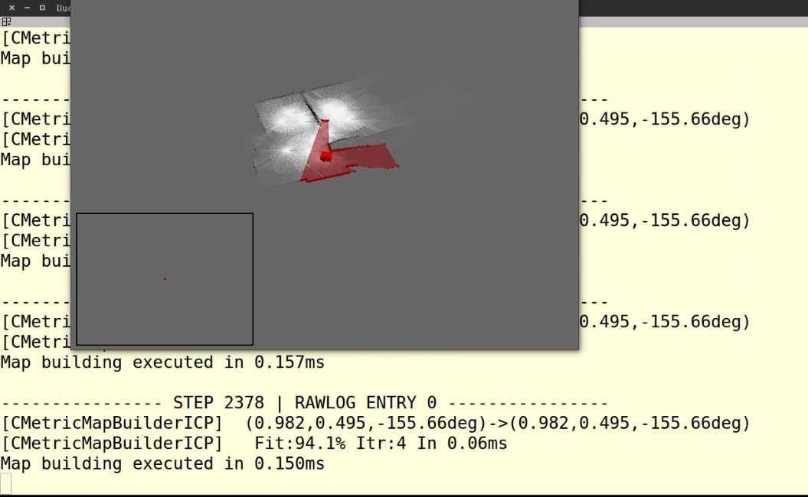

## rplidar_SLAM
some Demos of rplidar

### MRPT Demo
preparation:
[install MRPT](http://www.mrpt.org/MRPT_in_GNU/Linux_repositories)
sudo add-apt-repository ppa:joseluisblancoc/mrpt
sudo apt-get update
sudo apt-get install libmrpt-dev mrpt-apps 

#### 1. rplidar_mrpt_sample
	a. mkdir build; cd build
	b. cmake ..
	c. make
	d. rplidar_test dev/ttyUSB0

#### 2. icp_slam_live
	a. icp-slam-live icp-slam-live_demo_RPLIDAR_gridmap.ini

